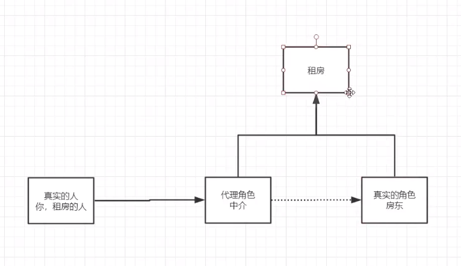

##常用依赖
```
<dependency>
    <groupId>org.springframework</groupId>
    <artifactId>spring-context</artifactId>
    <version>5.3.5</version>
</dependency>
<dependency>
    <groupId>junit</groupId>
    <artifactId>junit</artifactId>
    <version>4.13</version>
    <scope>test</scope>
</dependency>
```
        
 ##注解说明  
   
 <context:component-scan base-package="com.kuang"/>  
 <context:annotation-config/>  
   
 @Autowired:自动装配通过类型、名字  
    如果Autowired不能唯一自动装配上属性，则需要@Qualifier(value = "cat111")  
 @Resource:自动装配通过名字、类型  
--- 
 @Component 有几个衍生注解 在web开发中，按照mvc三层架构分层。注入beans中  
 dao[@Repository]  
 service[@Service]  
 controller[@Controller]  
---  
 @Scope:单例模式 多例模式注解  
 @Scope(value = "singleton")  
 @Scope(value = "prototype")  
 ---
 
 ##代理模式
 
  代理模式的好处:  
  1.可以使真实角色的操作更加纯粹！不用去关注一些公共的业务  
  2.公共也就交给代理角色！实现业务的分工！  
  3.公共业务发生扩展的时候会，方便集中管理！  
  缺点：  
  1.一个真实的角色会产生一个代理角色；代码量会翻倍~开发效率变低  
 ###静态代理
 代码步骤：  
 1.接口
```
public interface Rent {
    public void rent();
}
```
 2.真实角色
```
public class Host implements Rent{
    @Override
    public void rent() {
        System.out.println("房东要出租房子");
    }
}
```
 3.代理角色
```
public class Proxy implements Rent{
    private Host host;

    public void setHost(Host host) {
        this.host = host;
    }

    @Override
    public void rent() {
        seeHouse();
        host.rent();
        contract();
        fare();
    }

    public void seeHouse(){
        System.out.println("中介带你看房子");
    }
    public void contract(){
        System.out.println("和中介签定租赁合同");
    }
    public void fare(){
        System.out.println("收中介费");
    }

}
```
 4.客户端访问代理角色
```
public class Client {
    public static void main(String[] args) {
        Host host = new Host();
        Proxy proxy = new Proxy();
        proxy.setHost(host);
        proxy.rent();
    }
}
```
###动态代理


##AOP
